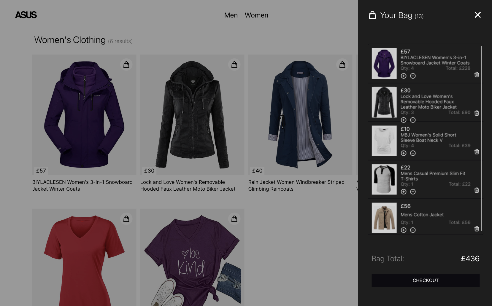

# The E-commerse store

Welome to the ASUS e-commerse store. Built using React.js, Typescript & Styled Components, the store includes a sleek and responsive UI with some cool features. Have a play around and enjoy.

## DEPLOYED SITE

Here's a link to the <a href="https://eshoplw.netlify.app/">deployed site</a>.

## FEATURES

Here is a list of some of the key features of the application:

- Add to cart
- Remove from cart
- Increase and decrease item quantity
- Shopping bag: open/close animation, close off-menu click
- Bag icon quantity display
- Linking Between Pages

## KEY SKILLS COVERED

Being a more challenging project, I was able to develop a number of skills:

- React-router-dom: multiple routes (pages) inside application, and linking routes between eachother.
- UseContext(): State management, excellent for keeping the code clean and readable.
- More React Hooks: useState(), useEffect(), useLocation().
- API fetch for the clothes data.
- Javascript array methods: .find(), .reduce(), .map(), .filter().
- Responsive from mobile through to desktop.
- Reusable components: The results component is used on both the Men and Women pages, keeping them both very clean.
- Object destructuring: select exactly what to import to each component when using useContext().
- Tightly scripted code using typescript.

## TOP CHALLENGE

This project was filled with lots of exciting twist, turns and chellenges. For me, the number one challenge was:

- Getting to grips with the JS array methods. The biggest head bang was working out how to select an item and add it to the bag. It sounds simple, right? But it involves a fair bit of of work. I invite you to check out the "increaseBagQuantity" function in the ShoppingBagContext file, and see if you can work it out.

## BIGGEST WINS

With this being one of the more complex projects I've worked on, it enabled me to try out more advanced tools. For which I'm incredibly pleased to have learned. The two biggest wins for me were:

- Implementing useContext for the first time: it made state management so incredibly simple and tidy. I can't believe I didn't use it sooner!
- React-router-dom: Another amazingly simple tool that enables you to easily implement multiple pages and link between them. Before this, I was conditionally rendering components. Another excellent tool for for the belt.

## FUTURE IMPLEMENTATIONS

The exciting thing about this project is that there is so much scope for further development. Some possible future implementions could include:

- Create a checkout modal notification
- Add burger menu for Mobile
- Add Local Storage functionality: A simple solution to store user data locally and improve user experience
- Add authentication with firebase
- Run some unit tests with jest, and end-to-end tests with cypress
- Find an AIP with more data results, so the page can feel more life-like
  - If not possible, create own data set to answer above challenge.

